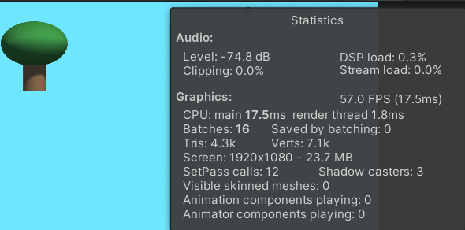

# CS413_Apple_Picker_ECS

APA4 is the ECS version 

ApplePicker is the old OOP Version

# I ain't going to lie

I don't know if I exported the files correctly so 
I put the whole project in for both and the 
exports you can try both open the ECS 
project as 3d URP

# OOP APPLEPICKER FPS

# ECS APPLEPICKER FPS

